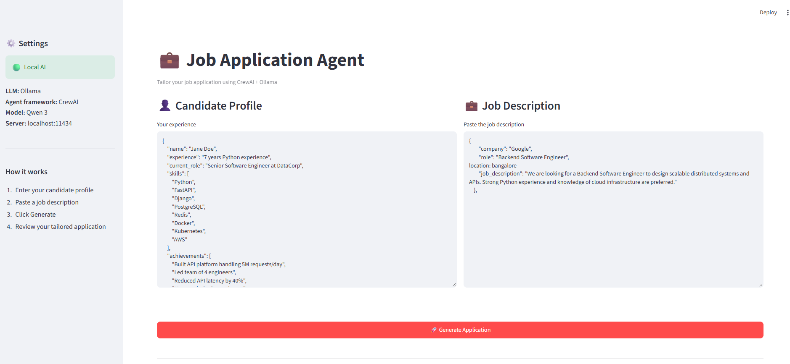
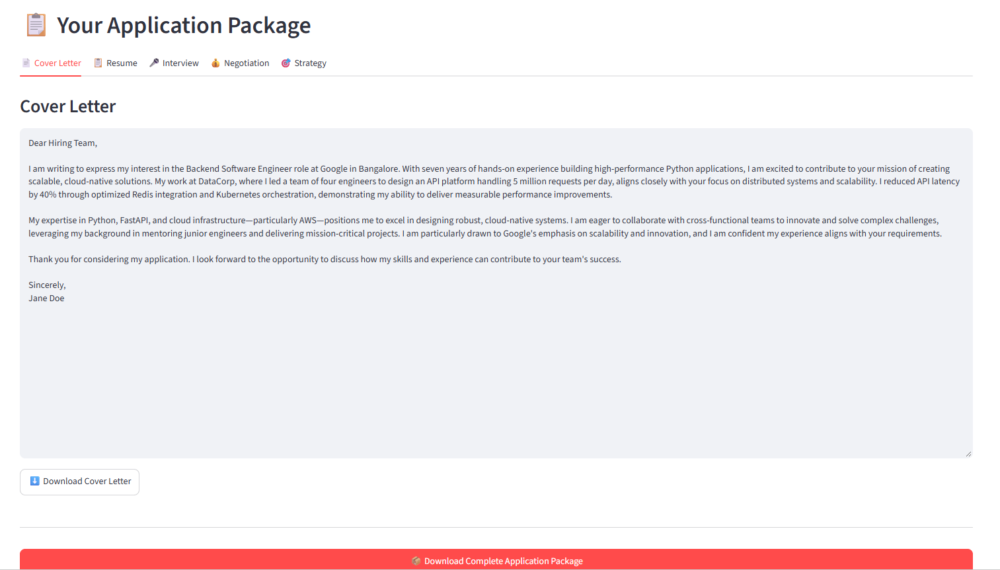
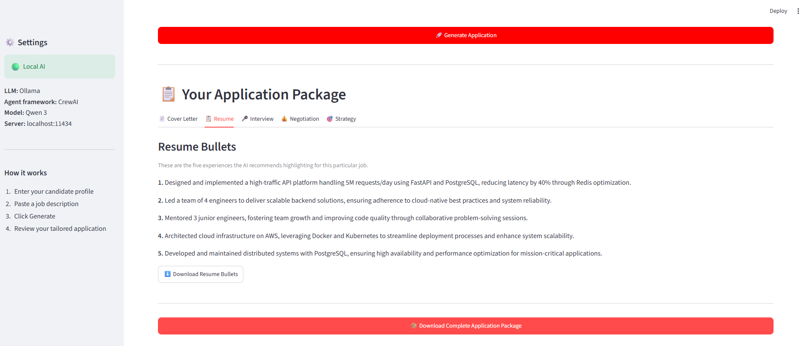

# 💼 Job Application Agent

A local AI-powered job application assistant built with **CrewAI, Ollama, and Streamlit**.

Paste a job description and your candidate profile, and the agent generates a tailored application package including:

* 📄 Cover letter
* 📋 Resume bullet points
* 🎤 Behavioral & technical interview questions
* 💰 Compensation/negotiation estimate
* 🎯 Application strategy

Everything runs locally through **Ollama**.

---

## 🏗️ Architecture

```text
                    ┌──────────────────┐
                    │    Streamlit     │
                    │    Frontend      │
                    └────────┬─────────┘
                             │
                             ▼
                    ┌──────────────────┐
                    │     CrewAI       │
                    │   Orchestration  │
                    └────────┬─────────┘
                             │
                 ┌───────────┴───────────┐
                 ▼                       ▼
        ┌─────────────────┐     ┌─────────────────┐
        │  Job Analyst    │     │  Career Coach   │
        │     Agent       │────▶│     Agent       │
        └─────────────────┘     └────────┬────────┘
                                         │
                                         ▼
                                ┌─────────────────┐
                                │     Ollama      │
                                │   Local LLM     │
                                └─────────────────┘
```

### How it works

1. **Streamlit** provides the web interface.
2. The job description is passed to the **Job Requirements Analyst**.
3. The analyst identifies important skills, keywords, responsibilities, and hiring priorities.
4. The analysis is passed to the **Career Coach** agent.
5. The Career Coach combines the job analysis with the candidate profile.
6. The result is returned as structured data.
7. Streamlit displays the results in separate sections.

The application uses Ollama locally, so the job description and candidate profile do not need to be sent to a cloud LLM provider.

---

## 🛠️ Tech Stack

* **Python**
* **CrewAI** — multi-agent orchestration
* **Ollama** — local LLM inference
* **Streamlit** — web interface
* **Pydantic** — structured AI output

---
## 📸 Example

Here's an example of the application running locally:





The screenshot shows the generated cover letter, tailored resume bullets, interview preparation, and negotiation recommendations.

